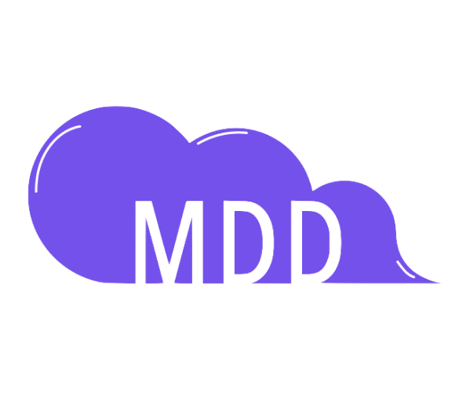

<div align="center" id="top"> 
  
</div>

<h1 align="center">Monde de Dev</h1>

<p align="center">
  
  
  
</p>

<p align="center">
  <a href="#repository-structure">Repository structure</a> &#xa0; | &#xa0;
  <a href="#features">Features</a> &#xa0; | &#xa0;
  <a href="#technologies">Technologies</a> &#xa0; | &#xa0;
  <a href="#requirements">Requirements</a> &#xa0;
</p>

<br>

MDD is a fullstack web application designed to facilitate content sharing and user interactions around thematic articles. Users can register, subscribe to themes, publish articles, and engage through comments. The application ensures a seamless experience across desktop and mobile devices.

This project follows a **Minimum Viable Product (MVP)** approach, focusing solely on essential functionalities without a dedicated back-office.


## Repository structure

```
/Savasana app
│── /front    # Angular application
│── /back     # Spring Boot API
│── /resources   # Additional project resources (postman collection, sql script, coverage)
│── README.md    # Main project documentation (you are here)
```

Each section has its own **README file** with specific installation and setup instructions:  

- 📄 **Frontend** (`/front/README.md`) – Angular application setup and usage  
- 📄 **Backend** (`/back/README.md`) – Spring Boot API setup and usage  

---

## ✨ Features

### **User Management**
- User registration with email, password, and username.
- Login using either email or username with password authentication.
- Persistent user sessions across browser sessions.
- Profile management (update email, username, and password).
- Logout functionality.

### **Subscription Management**
- View the list of all available themes.
- Subscribe to a theme.
- Unsubscribe from a theme.

### **Article Management**
- View a personalized news feed sorted chronologically.
- Sort articles from newest to oldest or vice versa.
- Create an article (assign a theme, set a title, and write content).
- View an article with full details (theme, title, author, date, content, and comments).
- Add comments to articles.